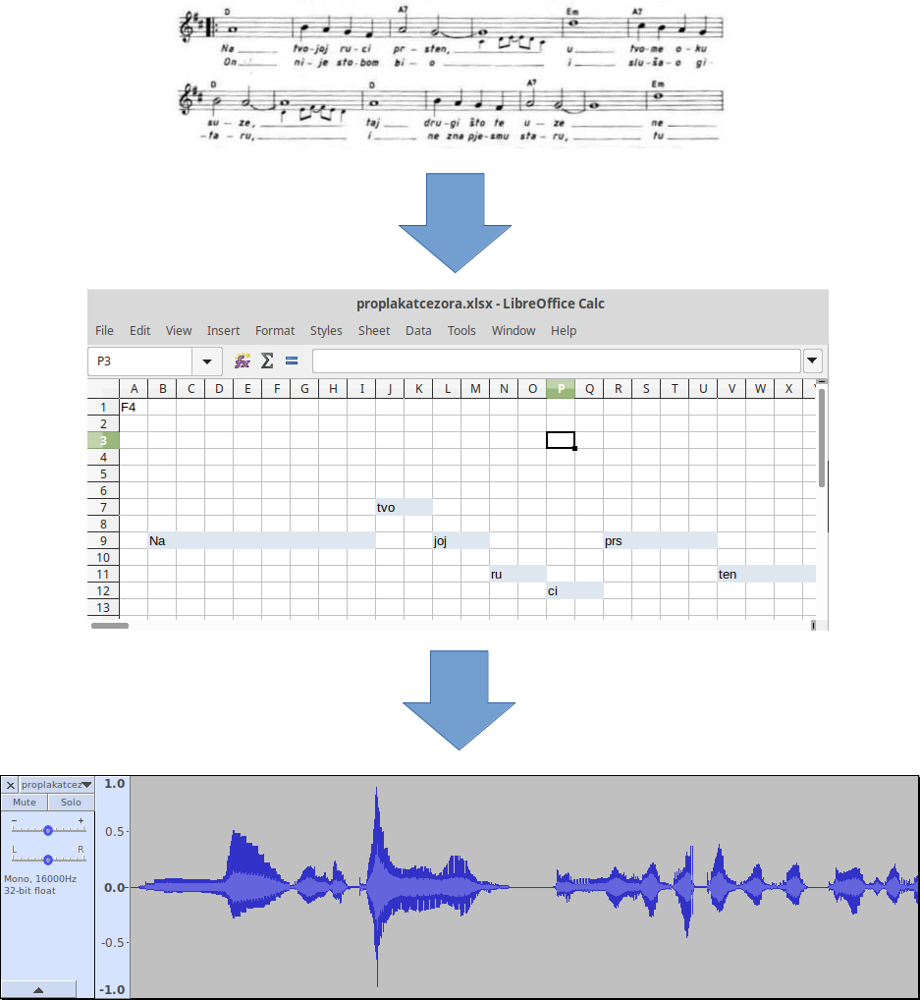

# Misho

Misho is an artificial Croatian singer. It reads songs from an excel file and sings it in Croatian.

## How does it work?

You take a piece of music and transcribe it to excel. Then just pass the excel file to Misho and you'll get an audio file. At last, you can enjoy the divine voice of Misho.

## Prerequisites

Misho uses [MBROLA](https://github.com/numediart/MBROLA) for actual speech synthesis, so you need to have it installed if you want to make Misho sing on your system.
MBROLA .deb and .rpm packages can be found in some of the major Linux distributions.

## Excel file format

Take a look at [example](example/).
It's basically a form of piano roll with lyrics.
Please don't enter any notes in first column or first row, they are reserved for future use.
Cell A1 denotes which note of piano roll would first row represent (can be used for easy transposition).

